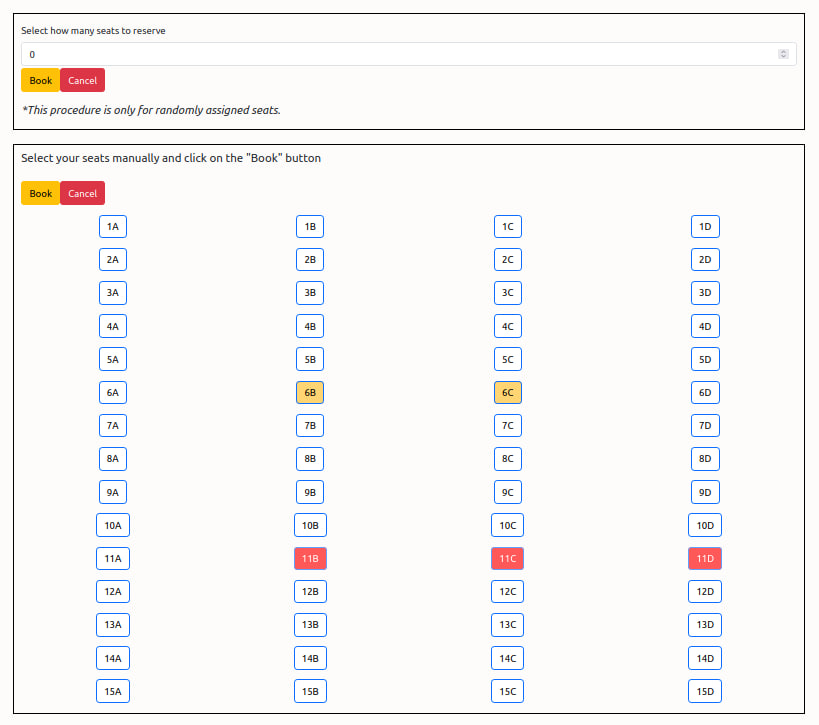

# Exam #2: "AirplaneSeats"
## Student: s291871 LECLERCQ ALESSIA 

## React Client Application Routes

- Route layout: contains the navbar with login button, title of the page and name of the authenticated user (if authenticated).
- Route `/`: index which contains the flights the user can select among.
- Route `/login`: login form for user authentication.
- Route `/flights/:flightId`: flightId is the identifier of the flight.
  - If the user is not authenticated: it contains the 2D flight visualization and statistics (total seats, available seats, and occupied seats). 
  - If the user is authenticated and he/she already has a reservation for the concerned flight, then the page displays the 2D flight visualization, the statistics (as in the not-authenticated case) and a button to delete the reservation.  
  - If the user is authenticated, but he/she has not a reservation for the concerned flight yet, then the page displays the flight statistics (total seats, available seats, occupied seats, and reserved seats); furthermore, it displays a form to select a number of seats to book and a 2D interactive visualization of the plane for booking purposes. 
- Route `*`: Not Found Page 

## API Server
### Pages and miscellaneous
- GET `/api/flights` : gets all flights' information
- GET `/api/flights/:flightId` : returns the single flight information, the flight is identified by flightId
- GET `/api/flights/:flightId/seats`: returns all seats for the flight identified by flightId
- DELETE `/api/flights/:flightId/booking`: deletes the reservation associated to the flight (identified by flightId) and the autheticated user
- POST `/api/flights/:flightId/booking`: checks if any of the requested seats have been booked, eventually it adds a reservation associated to the flight (identified by flightId) and the autheticated user. 
- POST `/api/sessions`: performs login 
- GET `/api/sessions/current`: gets authenticated user infomation 
- DELETE `/api/sessions/current`: performs logout

## Database Tables

- Table `users` - Stores user informations
- Table `planes` - Stores the available planes
- Table `seats` - Stores the seat on each plane

## Main React Components
- `BookingForm` ("./Components/BookingForm.jsx): contains the form that can be used by the user to make a randomly assigned seats reservation. The form consists of a single numeric input. Furthermore it contains two buttons to confirm the reservation and to cancel it (restore the form) 
-  `LoginForm` ("./Components/Login.jsx): contains the form that is used for authentication purposes. The form consists of the textual input fields and a button to submit.
- `FlightsTable` ("./Components/FlightsTable.jsx): contains the table to visualize all possible flights with name, type, seats availability and a link to each flight single visualization (i.e., the button that links to `/flights/:flightId`). 
- `NavigationBar` ("./Components/NavigationBar.jsx): contains the navigation bar with the page's title (link to `/`), the login/logout button, and the user's name visualization when he/she is authenticated.
- `PlaneGrid` ("./Components/PlaneGrid.jsx): renders the 2D visualization of the flight's seats on a grid form and two buttons that are displayed only if the user is authenticated and can make a reservation: the first to confirm the booking and the second to cancel the reservation. 
- `PlaneObject` ("./Components/PlaneGrid.jsx): models each seat individually depending on the user and the seat status. 
- `SingleFlight` ("./Components/SingleFlight.jsx): it defines functions and it enables to decide whether to display `PlaneGrid` in a "LoggedView" or "NotLoggedView" depending on the user's status. 
- `FlightsInformations` ("./Components/SingleFlight.jsx): in any case it displays statistics according to the total number of seats of the plane, the seats availablity and the number of occupied seats. If the user is authenticated and can book the flight, then it also shows the number of requested seats by the user.
- `LoggedView` ("./Components/SingleFlight.jsx): if the user is authenticated but already has a reservation of the flight, the component shows a button that allows the user to delete his reservation and the 2D not interactive visualization of the flight. If the user can make a reservation, instead, it shows the random seat selection form and the interactive 2D visualization. 

## Screenshot

## Users Credentials

- aLeclercq, ciaociao
- mLaborante, ciaociao
- lTredese, ciaociao
- rBaronio, ciaociao
